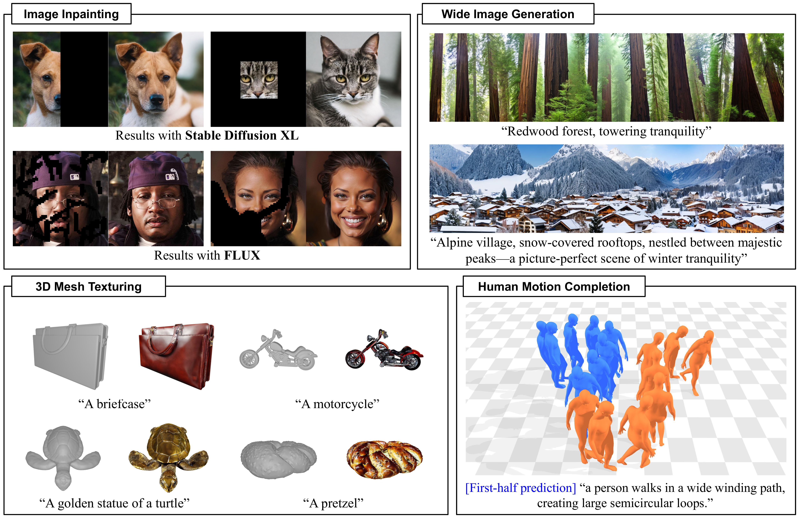

<div align="center">

# Accelerated Likelihood Maximization for Diffusion-based Versatile Content Generation

### ECCV 2026

[Hyunsoo Lee](https://hleephilip.github.io/) ·
[Inwoo Hwang](https://inwoohwang.me/) ·
[Young Min Kim](https://3d.snu.ac.kr/members/)

[](https://hleephilip.github.io/ALM/)
[](https://arxiv.org/abs/2606.31323)



</div>

ALM is a training-free diffusion sampling method for completing and extending partially observed content. 
It performs score-based likelihood maximization over unobserved variables while keeping the pretrained diffusion model fixed. 
A one-step approximation makes the optimization practical at each reverse diffusion step.


## Installation

The pipelines require three separate Conda environments because their PyTorch, CUDA, and Diffusers versions are not mutually compatible. 
The supported setup targets Linux systems with an NVIDIA GPU.

| Task | Conda name | Specification | Pipelines |
| --- | --- | --- | --- |
| Image experiments | `ALM` | [requirements.txt](requirements.txt) | Inpainting and wide image generation |
| Human motion completion | `ALM-motion` | [environment-motion.yml](environment-motion.yml) | Motion completion, evaluation, and rendering |
| 3D mesh texturing | `ALM-mesh` | [environment-mesh.yml](environment-mesh.yml) | Mesh texturing |

Create the image experiments environment with `uv`:

```bash
conda create -n ALM python=3.12 -y
conda activate ALM
python -m pip install uv
uv pip install -r requirements.txt
```

Create the task-specific environments from their pinned specifications:

```bash
conda env create -f environment-motion.yml
conda env create -f environment-mesh.yml
```

Detailed installation and model-access instructions are provided in the [image experiments](docs/image-experiments.md), [human motion completion](docs/motion-completion.md), and [3D mesh texturing](docs/mesh-texturing.md) documents.


## Quick Start

Run all commands from the repository root.


### Image Inpainting

```bash
conda activate ALM
bash scripts/run_inpainting.sh
```

White mask pixels denote regions generated by ALM. 
Results are written to `outputs/inpainting/`.


### Wide Image Generation

```bash
conda activate ALM
bash scripts/run_wide_image.sh
```

The reference command produces a 2048×512 image under `outputs/wide_image/`.


### Human Motion Completion

Complete the motion-asset preparation described in the
[motion completion guide](docs/motion-completion.md), then run:

```bash
conda activate ALM-motion
bash scripts/run_motion_completion.sh
```


The script reproduces the qualitative results with test motions and three repetitions. 
The full quantitative evaluation is available through `scripts/run_motion_evaluation.sh`.


### 3D Mesh Texturing

```bash
conda activate ALM-mesh
bash scripts/run_mesh_texturing.sh
```

The reference command textures `data/meshes/suitcase.obj` using the prompt `a suitcase` and writes the final OBJ, material, texture, and rendered views to `outputs/mesh_texturing/`.


## Data and Pretrained Models

The repository includes compact examples for the image and mesh pipelines under `data/`. 
Large motion datasets, evaluator files, body models, and checkpoints are excluded in this public repository. Their canonical locations and preparation procedure are documented in the [motion completion guide](docs/motion-completion.md).
Pretrained diffusion models are downloaded from Hugging Face on first use.
Accept the applicable model licenses and authenticate with the Hugging Face Hub when required. 


## Acknowledgements

This implementation builds on the following open-source projects and resources:

- [Diffusers](https://github.com/huggingface/diffusers)
- [Objaverse-XL](https://github.com/allenai/objaverse-xl)
- [StyleID](https://github.com/jiwoogit/StyleID)
- [SyncTweedies](https://github.com/KAIST-Visual-AI-Group/SyncTweedies)
- [CondMDI](https://github.com/setarehc/diffusion-motion-inbetweening)
- [StarGAN-v2](https://github.com/clovaai/stargan-v2/tree/master)


## Citation

```bibtex
@inproceedings{lee2026alm,
    title={Accelerated Likelihood Maximization for Diffusion-based Versatile Content Generation},
    author={Hyunsoo Lee and Inwoo Hwang and Young Min Kim},
    booktitle={European Conference on Computer Vision (ECCV)},
    year={2026}
}
```